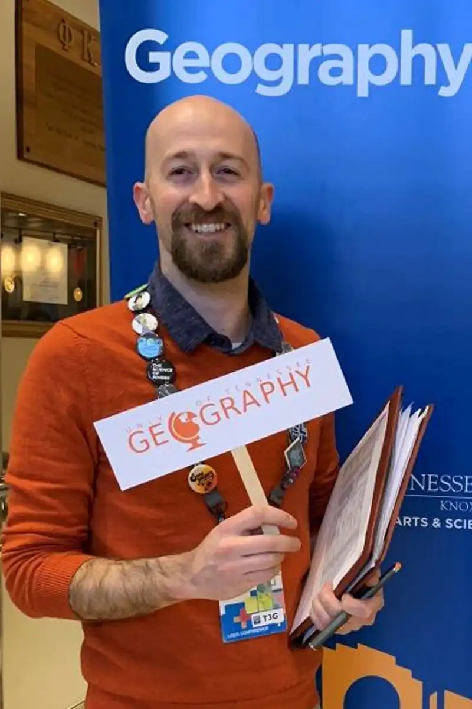

{fig-alt="Michael Camponovo" width="250"}

I am a GIS educator, outreach coordinator, and community-engaged geospatial practitioner at the University of Tennessee, Knoxville. My work focuses on helping students, educators, professionals, and community partners use geospatial tools to understand problems, communicate clearly, and make better decisions.

My professional work sits at the intersection of teaching, outreach, applied GIS, uncrewed aerial systems, cartography, and student mentoring. I develop applied learning experiences that connect technical skills with real-world questions, including GIS analysis, web mapping, UAV data collection, remote sensing, cartographic communication, and professional development.

## Professional Focus

My work includes:

- Teaching undergraduate and professional-development courses in GIS, cartography, UAVs, remote sensing, and geospatial problem solving.
- Developing workshops and outreach programs for students, educators, public agencies, and professional audiences.
- Supporting community-engaged GIS and UAV projects with students, colleagues, and partner organizations.
- Mentoring students as they prepare for conferences, research opportunities, internships, jobs, and graduate school.
- Contributing to professional organizations, outreach initiatives, and geospatial education efforts across Tennessee.

## Approach

I try to design learning experiences around realistic problems rather than isolated tools. In GIS, the technical steps matter, but they are only part of the work. Students and professionals also need to understand the question being asked, the data needed to answer it, the limitations of the analysis, and the best way to communicate results to a real audience.

This portfolio highlights selected examples of that work, including teaching materials, workshops, community projects, geospatial products, mentoring activities, service roles, and professional recognition.

## Contact

Contact information and professional links will be added here.