

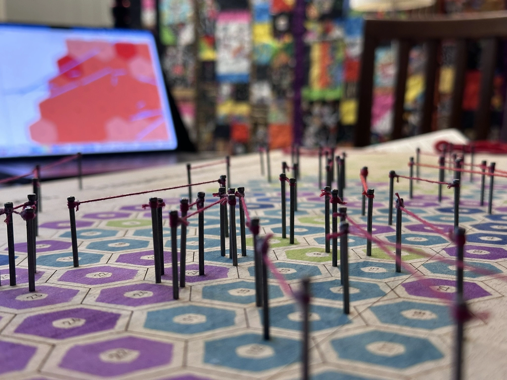

This project began with a question: **what happens when a GIS map has to become a physical object?**

The finished map shows the frequency of recorded tornado tracks across Tennessee using stamped hexagons, while the strongest tornadoes—F/EF4 and F/EF5 events—are represented with nails and red string. What began as a digital cartographic design became an experiment in translating GIS geometry, classification, and symbology into wood, ink, metal, and thread.

The project was developed collaboratively by **Michael Campanovo** and **Tracy Homer**, combining GIS/cartographic design with fabrication expertise.

## The cartographic idea

The physical map communicates two aspects of Tennessee tornado history:

1. **Frequency** — where tornado tracks have occurred most often.
2. **Extreme events** — where the strongest F/EF4 and F/EF5 tracks occurred.

The final hexagon classes are:

- **1–5 tornadoes**
- **6–10 tornadoes**
- **11–20 tornadoes**
- **21–30 tornadoes**
- **31–59 tornadoes**

{fig-cap="The digital cartographic design in ArcGIS Pro before export for fabrication."}

## Designing a GIS map for fabrication

Designing for fabrication changed decisions that would normally be trivial in a digital map. A line on a screen can be arbitrarily short. A physical tornado track represented by two nails and string cannot.

### Generalizing the shortest tracks

Several very short tornado tracks did not provide enough physical distance for two pilot holes, nails, and string. Those tracks were selectively lengthened for fabrication while preserving their general location and orientation.

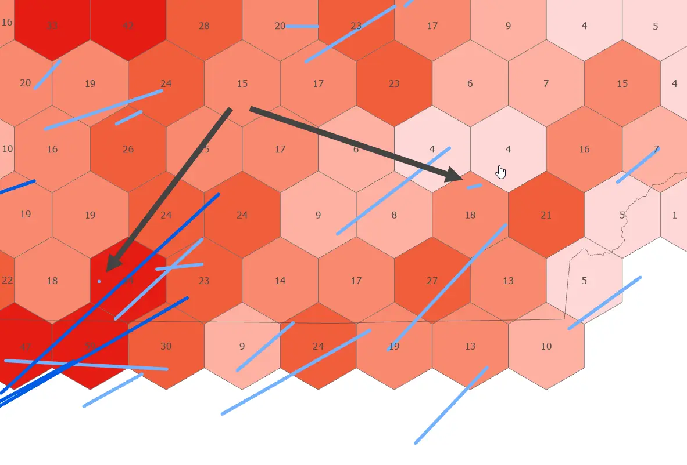{fig-cap="Several very short tracks were selectively generalized so two nails and a string segment could be placed at the final map scale."}

> **Design challenge:** A cartographic symbol that works perfectly on screen may be physically impossible to build at the final map scale.

## Moving from GIS to the laser cutter

ArcGIS Pro remained the geographic and cartographic master. The final geometry was exported as **SVG**, preserving vector linework for fabrication.

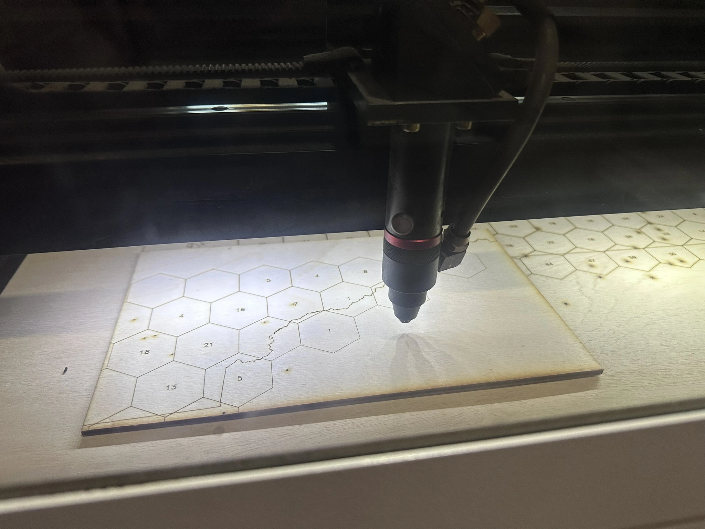{fig-cap="The 18 × 36 inch map during laser engraving."}

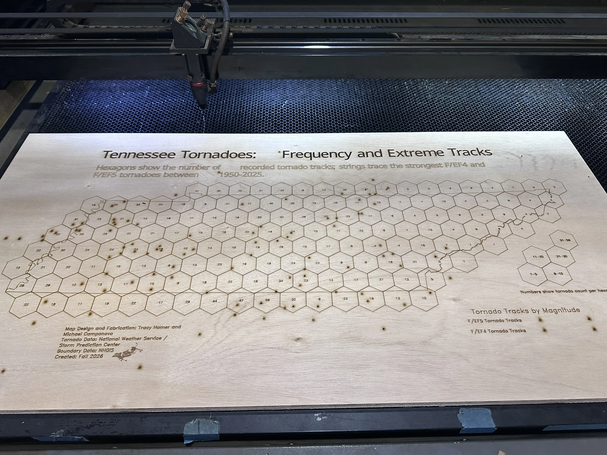{fig-cap="The engraved map before the hand-applied frequency colors and extreme-track string layer were added."}

A small flying-cow reference was engraved into the marginalia as an Easter egg.

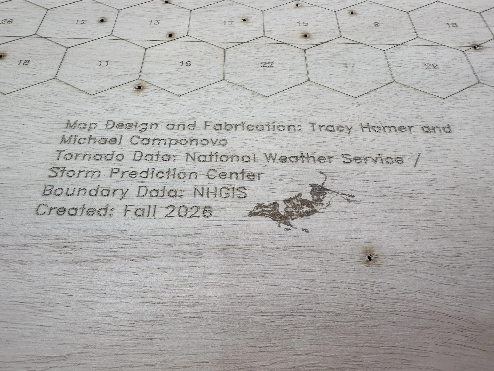{fig-cap="A small flying-cow Easter egg was engraved into the marginalia."}

## Building the frequency symbology by hand

The hexagon classes were applied manually using archival inks. Tracy fabricated a custom **hexagon-donut stamp** and clear registration jig so each stamp could be centered consistently.

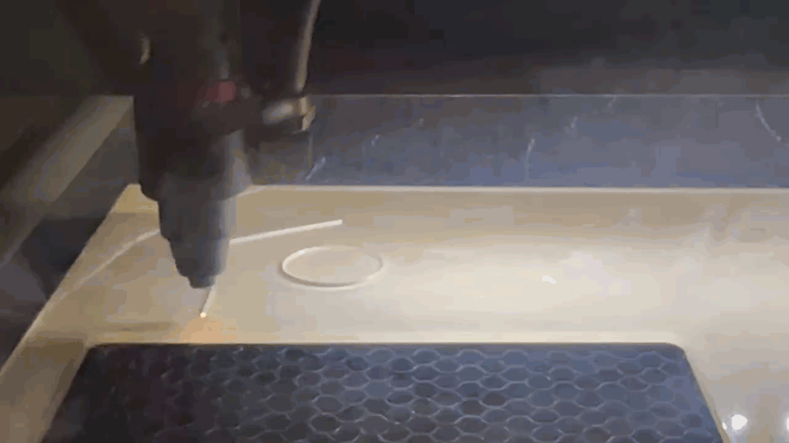{fig-cap="The custom hexagon-donut stamp and clear registration jig used to align the hand-stamped frequency classes."}

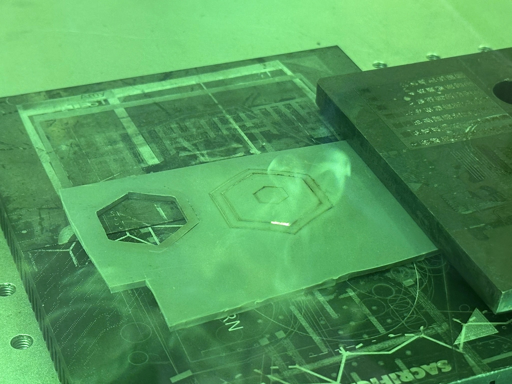{fig-cap="Approximately 155 hexagons were stamped individually using archival inks."}

Approximately **155 hexagons** were stamped individually.

## Turning extreme tornado tracks into string

Pilot holes were drilled at track endpoints, nails were installed, and red embroidery floss was stretched between them. Two red values distinguish **F/EF4** from **F/EF5** tornadoes.

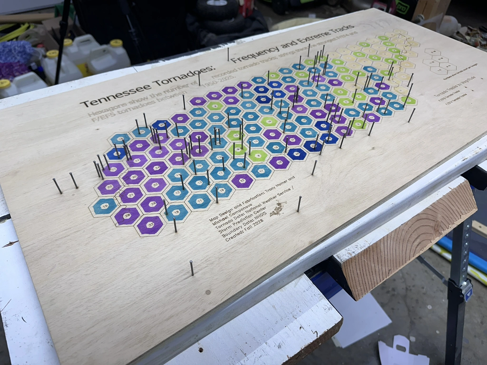{fig-cap="Pilot holes and 4D nails established the physical endpoints for the F/EF4–5 tornado tracks."}

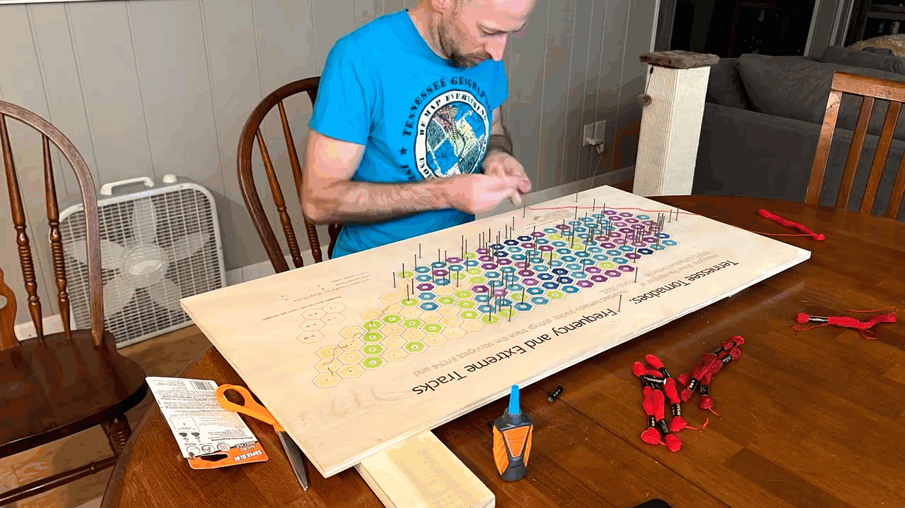{fig-cap="Red embroidery floss was stretched between track endpoints to create the physical extreme-tornado layer."}

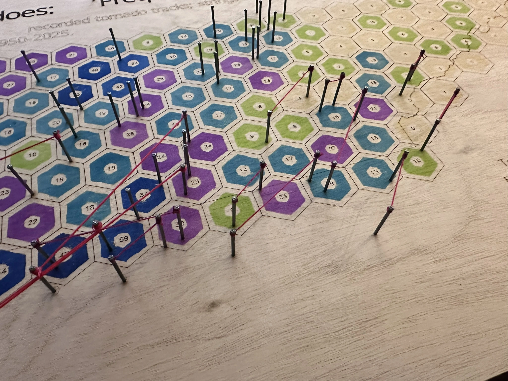{fig-cap="Two red string values distinguish F/EF4 and F/EF5 tornadoes."}

## When the legend needed a second pass

The first engraved legend revealed a late-stage problem: the class-break numbers were visibly misaligned. Rather than re-engraving the entire map, a revised legend was engraved and cut from **1/4-inch plywood**, finished, stamped, and glued over the original.

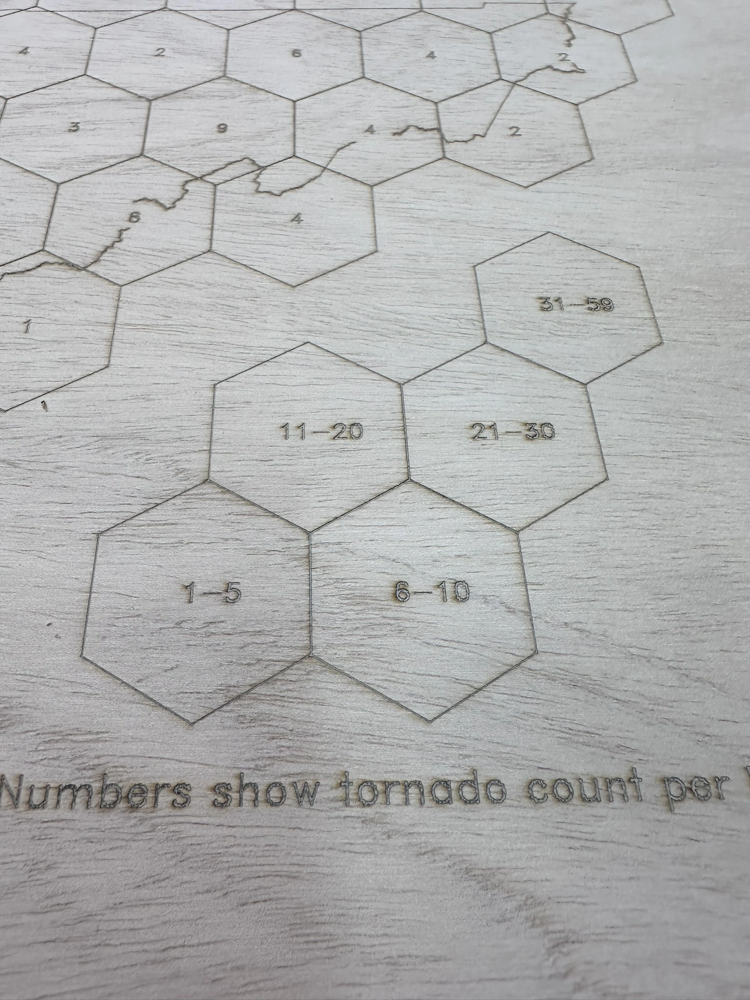{fig-cap="The original legend revealed a late-stage alignment problem with the class-break labels."}

{fig-cap="A revised legend was fabricated separately on 1/4-inch plywood rather than re-engraving the entire map."}

{fig-cap="The finished replacement legend became an intentional raised element of the final map."}

> **Design challenge:** Fabrication errors do not always require restarting a project. Sometimes the best solution is to redesign the problem into a new physical layer.

## Explore the tornado data

The physical map deliberately reduces a complex tornado dataset into tangible symbols. The interactive web map provides access to the underlying geography and additional detail.

<iframe
  title="Tornadoes in Tennessee Supplement to Physical Map"
  src="https://myutk.maps.arcgis.com/apps/mapviewer/index.html?configurableview=true&webmap=69af2b0977fd4239a47c9da4a8708189&theme=light&scroll=false&center=-85.69934398467406,34.73015386670354&scale=4622324.434309"
  allow="local-network-access; geolocation"
  loading="lazy">
</iframe>

[Open the interactive map in a new window](https://arcg.is/11ryO97){target="_blank"}

## What the physical map changed

The most important lesson from the project was that **a map stops behaving like a GIS layout once every symbol has to become a physical object**.

The transition from digital cartography to fabrication required decisions about minimum feature size, material behavior, registration, tolerances, repair strategies, and how much geographic detail could survive translation into a tactile object.

{fig-cap="A close-up of the finished map showing the combination of engraving, hand-stamped color, nails, string, and layered legend."}

## Final result

{fig-cap="The completed physical map ready for display."}

The completed project combines GIS analysis and cartographic design with laser fabrication, custom tooling, hand-applied color, and string art. The digital companion map preserves access to the underlying tornado data, while the physical version emphasizes the material decisions required to turn geographic information into an object.

## Tools and materials

**GIS and design**

- ArcGIS Pro
- ArcGIS Online / Map Viewer
- SVG vector workflow

**Fabrication**

- 18 × 36 inch plywood map surface
- CO₂ laser cutter/engraver
- Custom hexagon-donut stamp
- Clear registration jig
- Archival inks
- Pilot holes and 4D nails
- Red embroidery floss
- 1/4-inch plywood replacement legend

## Data and credits

**Tornado data:** National Weather Service / Storm Prediction Center tornado-track data.  
**Boundary data:** NHGIS.  
**GIS and cartographic design:** Michael Campanovo.  
**Fabrication and fabrication problem-solving:** Michael Campanovo and Tracy Homer.
