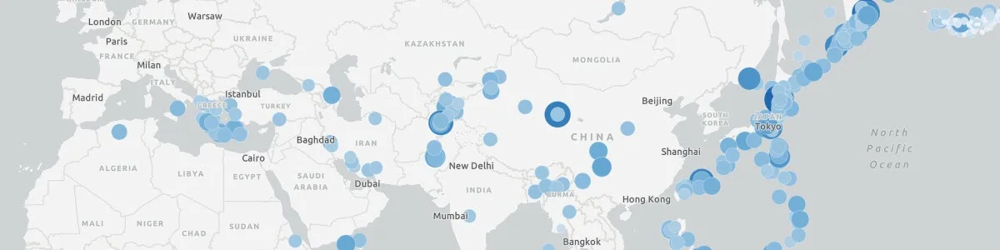
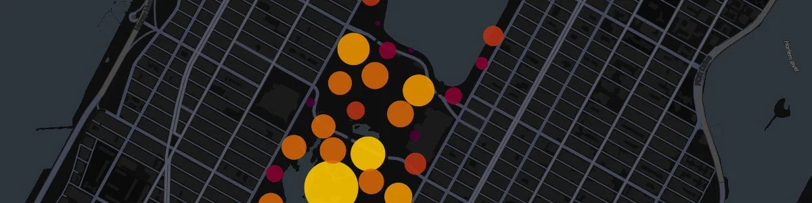
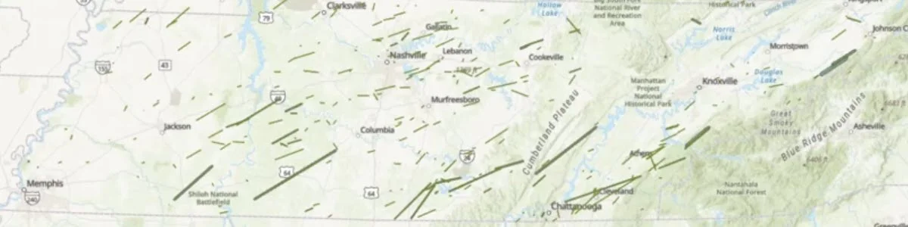
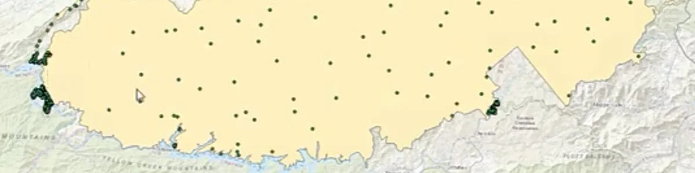
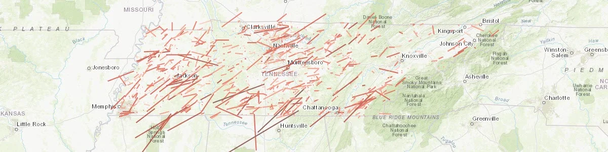
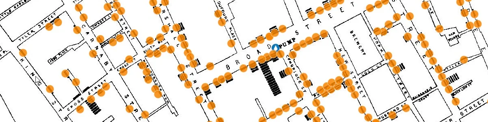

The **In-Class GIS Skill-Building Activities** were developed as part of a shift from a traditional synchronous lecture format to a flipped course model. After moving lectures to pre-recorded videos, in-class time could be used for short, focused practice activities that helped students build GIS skills before attempting larger lab assignments.

These activities were designed in response to a teaching challenge I observed in introductory GIS courses: students were often intimidated by full lab assignments, especially when they were still developing confidence with GIS concepts, software interfaces, data organization, and spatial-analysis workflows.

## Teaching Context

These activities were developed for **GEOG 311: Introduction to Geovisualization and GIS**. They were intentionally short, low-stakes, and focused on specific skills or concepts that students would later use in larger assignments.

The goal was to make in-class time more active and supportive. Instead of using class meetings primarily for lecture, students could practice, ask questions, make mistakes, troubleshoot, and build confidence with guidance.

## Project Role

My role included designing the in-class activities, aligning them with larger lab assignments, creating supporting instructions, selecting appropriate datasets and examples, and using class time to help students practice core GIS skills.

The activity instructions are maintained as Google Docs for classroom use. Public links may be added later after reviewing the materials for data permissions, student-facing scaffolding, and course-context details.

## Instructional Goals

These activities were designed to help students:

- build confidence before larger lab assignments,
- practice GIS skills in a low-stakes environment,
- connect lecture concepts to hands-on work,
- become more comfortable with GIS software and web GIS tools,
- improve data organization habits,
- develop spatial-thinking and interpretation skills,
- ask better questions before working independently.

## Selected Activity Examples

### Data Organization Exercise

{width="85%"}

A foundational activity focused on file management, workspace organization, data formats, and the practical habits students need for successful GIS work. Students download public datasets from the USGS Earthquake Catalog and the NYC Open Data Portal, practice working with CSV and shapefile downloads, unzip data, and organize files into a structured workspace.

This activity helps students understand that GIS work depends on more than software tools. Before students can map or analyze data, they need to know how to download, store, unzip, identify, and manage geospatial files.

**Skills and tools:** USGS Earthquake Catalog, NYC Open Data, CSV files, shapefiles, ZIP extraction, folder naming, workspace setup, data organization, cross-platform file handling.

### Data Exploration Exercise with ArcGIS Online

{width="85%"}

An introductory web GIS activity that helps students explore, visualize, and interact with earthquake data in ArcGIS Online. Students upload a CSV from the USGS Earthquake Catalog, visualize the data as points, experiment with symbol size and color, change basemaps, explore pop-ups, inspect attribute tables, and save a web map.

The activity is designed to give students an early success with real geospatial data. It introduces the idea that a table containing latitude and longitude coordinates can become an interactive map and that visualization choices affect how patterns are interpreted.

**Skills and tools:** ArcGIS Online, Map Viewer Classic, CSV upload, web maps, basemaps, pop-ups, attribute tables, symbolization by magnitude and depth, point size, point color, exploratory data visualization.

### In-Class Web GIS Exercise Using Kepler.gl

{width="85%"}

A web mapping activity that introduces students to rapid visualization using an open-source mapping platform. Students download earthquake data from the USGS and squirrel census data from NYC Open Data, then use Kepler.gl to create and compare different map types, including points, grids, hexbins, clusters, and heat maps.

This activity helps students compare visualization methods and think about which techniques best communicate different kinds of spatial patterns. It also gives students experience working outside the Esri ecosystem while reinforcing core web GIS concepts.

**Skills and tools:** Kepler.gl, USGS Earthquake Catalog, NYC Open Data, CSV, GeoJSON, web mapping, filtering, attribute-based styling, point maps, grid maps, hexbins, clusters, heat maps, 3D visualization.

### Basic Vector Tools In-Class Activity

{width="85%"}

A low-stakes ArcGIS Pro practice activity that helps students become familiar with common vector geoprocessing tools before applying them in larger lab assignments. Students work through short examples using Tennessee tornado tracks, Lower Mississippi watershed boundaries, USDA plant hardiness zones, and Tennessee wildfire perimeters.

The activity gives students guided practice with common GIS operations while also reinforcing data organization, spatial reference awareness, attribute-table interpretation, and tool-output comparison.

**Skills and tools:** ArcGIS Pro, geodatabases, buffer by field, dissolve, clip, merge, attribute-table review, spatial-reference interpretation, public GIS datasets, data organization.

### In-Class Intermediate Vector Tools Practice

{width="85%"}

An intermediate ArcGIS Pro activity that gives students guided practice with a wider range of vector workflows. Students create point features from latitude and longitude fields, create line features from start and end coordinates, repair missing spatial-reference information, generate random points, create service areas, calculate minimum bounding geometries, generate tessellations, and summarize bike-rack capacity using spatial joins.

The activity is intentionally broad, giving students repeated exposure to different geoprocessing patterns before they are expected to use these tools more independently. It also helps students recognize that GIS tools often support different parts of a larger analytical workflow.

**Skills and tools:** ArcGIS Pro, geodatabases, XY to Point, XY to Line, Define Projection, Create Random Points, Generate Service Areas, Minimum Bounding Geometry, Generate Tessellation, Spatial Join, coordinate fields, spatial references, service areas, hexagon aggregation.

### In-Class Intermediate Vector Tools Practice 2: Working With Tables

{width="85%"}

An intermediate activity focused on table-based GIS reasoning, selections, summaries, and proximity analysis. Students use tornado data to practice definition queries, summary statistics, and chart creation, then revisit a previous meth lab proximity question using online feature services, selected-feature workflows, and Select by Location.

This activity helps students move beyond “make a map” thinking and toward evidence-based GIS analysis. It emphasizes that many GIS questions are answered through attribute tables, filters, selections, summaries, and careful interpretation of selected records.

**Skills and tools:** ArcGIS Pro, definition queries, summary statistics, charts, attribute tables, Select by Location, Add Data from Path, online feature services, selected-feature workflows, proximity analysis, table interpretation.

### Point Pattern Practice with SoHo Cholera Outbreak

{width="85%"}

A point-pattern analysis activity built around the famous 1854 cholera outbreak in the SoHo neighborhood of London. Students take on the role of Dr. John Snow and use GIS techniques to investigate whether cholera deaths appear to be associated with a contaminated water pump.

The activity asks students to compare multiple visualization and analysis techniques, including graduated color, proportional symbols, buffers, Thiessen polygons, kernel density, and hot spot analysis. Students then decide which technique would be most effective for communicating evidence to a non-technical audience.

This activity is longer and more ambitious than the other in-class exercises, but it is valuable because it connects GIS analysis, epidemiology, spatial reasoning, historical data, and public communication.

**Skills and tools:** ArcGIS Online, graduated color, proportional symbols, buffers, Aggregate Points, Thiessen polygons, kernel density, hot spot analysis, point-pattern analysis, georeferencing concepts, heads-up digitizing concepts, spatial evidence, public-facing map communication.

## Teaching Significance

This collection reflects my approach to teaching GIS through scaffolding, practice, and confidence-building. Rather than expecting students to jump directly from lecture to complex labs, these activities create intermediate steps where students can practice specific skills, receive support, and build readiness for more independent work.

The activities also show how a flipped classroom model can make GIS instruction more active. Pre-recorded lectures provide conceptual background, while class time becomes a space for applied practice, troubleshooting, and skill development.

Taken together, these activities show a progression from foundational data management and web mapping to vector geoprocessing, table-based analysis, and point-pattern interpretation. The emphasis is not only on using GIS tools, but on helping students understand when and why those tools are useful.