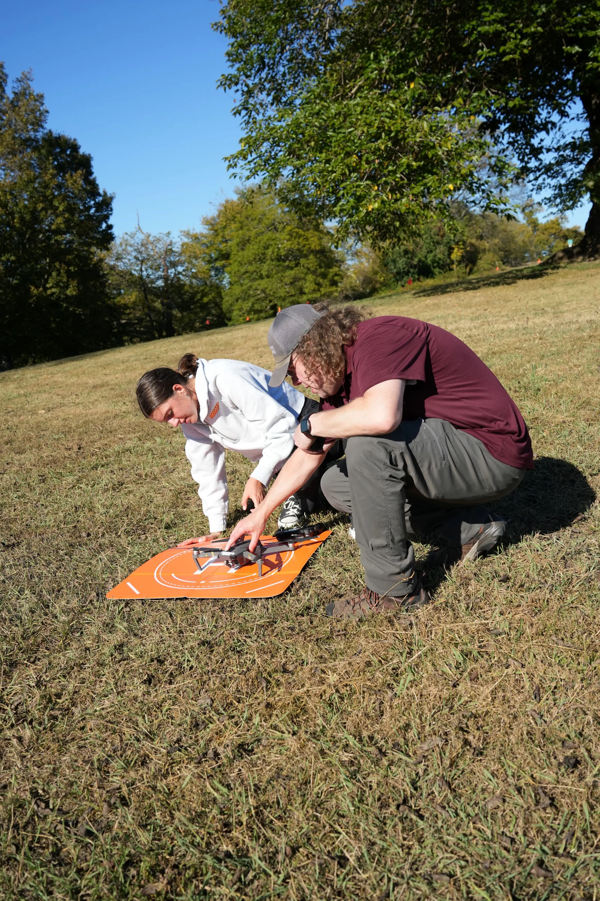
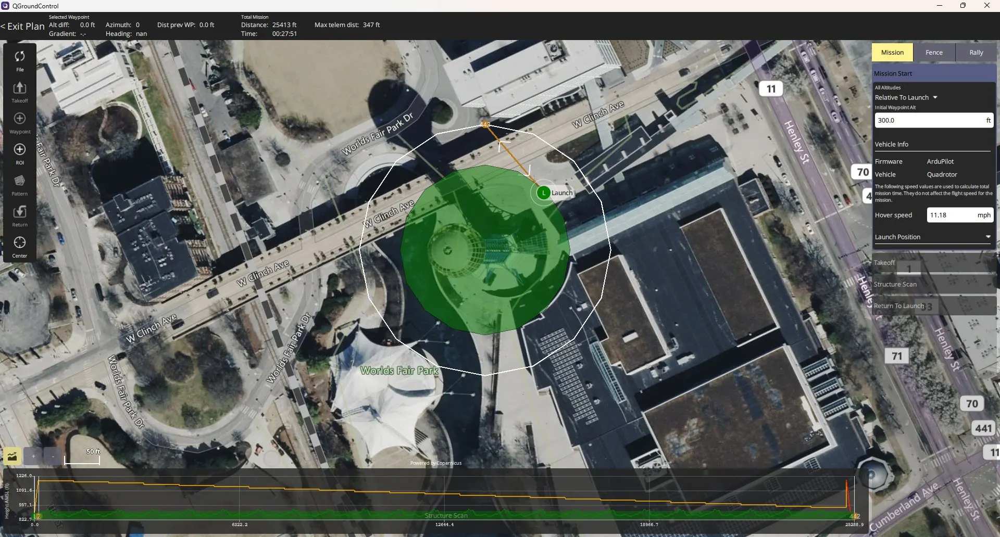
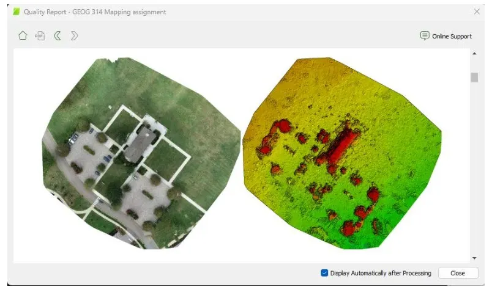

**Introduction to Uncrewed Aerial Systems** is a hands-on course that introduces students to the knowledge, skills, workflows, and professional responsibilities involved in operating small uncrewed aerial systems.

The course is organized around three major components: **FAA Part 107 exam preparation**, **hands-on flight training and data collection**, and **lab-based geospatial analysis**. Students then complete a final project where they apply what they have learned to produce a professional-style UAS product or analysis.

## Course Design

The course is designed to help students move from aviation knowledge and operational safety into hands-on flight skills, mission planning, data collection, and geospatial analysis. Students begin by learning the regulatory and safety context for UAS operations, then progress into manual flight, autonomous mission planning, image collection, data processing, and applied project work.

The course also introduces professional and ethical topics that extend beyond the FAA exam, including privacy, insurance, risk management, and responsible data collection.

Students work in teams during hands-on flight practice so they gain experience in multiple operational roles, including pilot and visual observer. Business application presentations and final projects are completed individually.

## FAA Part 107 Exam Preparation

The first major component of the course prepares students for the FAA Part 107 Remote Pilot Certificate exam. Students learn the major knowledge areas covered on the exam through lectures, practice activities, quizzes, and full-length practice exams.

Topics include airspace, sectional charts, airport operations, weather, regulations, loading and performance, emergency procedures, crew resource management, and aeronautical decision-making.

Although the course supports Part 107 exam preparation, it also includes topics that are important for professional UAS work but are not emphasized on the exam, such as privacy, insurance, liability, and responsible data collection.

**Skills and topics:** FAA Part 107 exam preparation, airspace, sectional charts, weather, regulations, airport operations, emergency procedures, aeronautical decision-making, privacy, insurance, professional responsibility.

## Hands-On Flight Training and Data Collection

{width="85%"}

Before handling drones, students complete the FAA TRUST certificate. Once they have completed that safety requirement, they begin hands-on flight training.

The flight training sequence starts with manual flight controls and basic aircraft handling. Students then apply those skills to several applied scenarios, including promotional photography and videography, mission planning for mapping, infrastructure inspection, and thermal data collection.

Students learn to fly several DJI aircraft, including a Phantom 4 Pro, DJI Mavic Mini, and DJI Mavic. The course also includes demonstrations of additional UAS platforms and sensors, including the Inspired Flight 1200A with a thermal sensor.

Hands-on activities include:

- manual flight control practice,
- pilot and visual observer teamwork,
- real estate-style photography,
- promotional videography,
- mission planning for 2D and 3D mapping,
- imagery collection for mapping products,
- roof and infrastructure inspection,
- thermal imaging for building energy assessment.

Students also learn to use operational planning tools to check weather, NOTAMs, temporary flight restrictions, and other conditions that affect safe UAS operations.

**Skills and tools:** FAA TRUST, manual flight controls, pilot/visual observer roles, preflight planning, weather checks, NOTAM checks, TFR checks, QGroundControl, mission planning, aerial photography, aerial videography, infrastructure inspection, thermal imaging.

## Ground Control and Mapping Workflows

{width="85%"}

The course introduces students to the relationship between UAS data collection and accurate geospatial products. Students learn how ground control points can improve mapping workflows and gain experience using Emlid GNSS receivers to collect ground control points with RTK.

This component helps students connect field data collection, positional accuracy, photogrammetry, and final mapping outputs.

**Skills and tools:** Emlid GNSS receivers, RTK, ground control points, field data collection, positional accuracy, mapping workflows.

## Lab Analysis and Geospatial Products

{width="85%"}

The lab portion of the course helps students transform collected imagery into usable geospatial and media products. Students process imagery, evaluate outputs, create mapping products, generate multispectral indices, and edit short promotional videos.

Students use Pix4D to create 2D and 3D mapping products from imagery collected during mission-planning activities. They also use Pix4D to work with multispectral imagery and create vegetation or surface indices. For promotional media workflows, students use DaVinci Resolve to edit short videos from collected footage.

**Skills and tools:** Pix4D, 2D mapping products, 3D mapping products, photogrammetry, multispectral indices, image processing, geospatial analysis, DaVinci Resolve, promotional video editing.

## Business Application Presentation

Students give a short individual presentation on a business application of UAS technology. This assignment asks students to investigate how drones are used in a professional field and explain the value, workflow, benefits, limitations, and potential risks of that application.

This component helps students connect the technical skills from the course to real industries and professional opportunities.

**Example application areas:** infrastructure inspection, real estate marketing, agriculture, emergency management, construction monitoring, environmental assessment, energy audits, forestry, conservation, and public safety.

## Final Student Project

The final project asks students to apply what they have learned across the course. Each student selects a project direction and produces a final deliverable based on the workflow they choose.

Final projects vary by student. Some students create short promotional videos using DaVinci Resolve, while others create 2D and 3D mapping products using Pix4D. Each student gives a short presentation explaining their project, workflow, outputs, and lessons learned.

The project gives students an opportunity to demonstrate the complete UAS workflow: planning a mission, collecting data safely, processing the data, interpreting the results, and communicating their findings.

## Teaching Significance

This course reflects my approach to teaching geospatial technology through applied, scaffolded, hands-on learning. Students do not simply learn about drones as a technology; they practice the full workflow required to operate UAS responsibly and produce meaningful outputs.

The course connects aviation knowledge, field operations, mission planning, data collection, RTK ground control, photogrammetry, remote sensing, geospatial analysis, media production, and professional communication. By the end of the semester, students have experience with both the operational and analytical sides of UAS work.