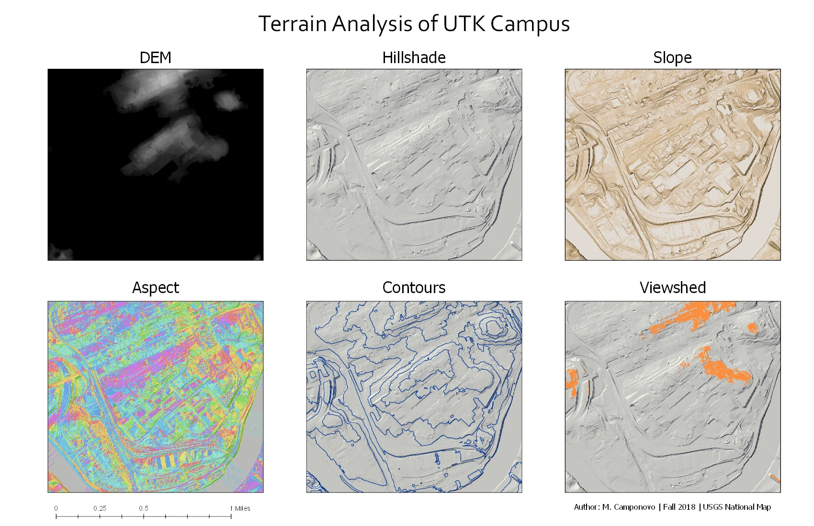

The **Terrain and Raster Analysis Lab Sequence** is a two-part lab assignment developed for **GEOG 311: Introduction to Geovisualization and GIS**.

In the first lab, **Introduction to Terrain Analysis**, students use lidar-derived elevation data to create terrain products for the University of Tennessee, Knoxville campus. In the second lab, **Raster Analysis**, students use the outputs from the first lab to identify hypothetical locations suitable for solar-panel installation.

## Teaching Context

Raster analysis can be challenging for students because it requires them to think differently about GIS data. Instead of working with discrete features such as points, lines, and polygons, students must learn to interpret continuous surfaces, cell values, derived rasters, and map algebra.

This two-part lab sequence is designed to scaffold that transition. Students first learn how elevation data can be transformed into meaningful terrain products. They then use those same products in the following lab to practice reclassification, raster calculator workflows, and suitability-style analysis.

The scenario places students in the role of a sustainability coordinator asked to identify campus locations that may be suitable for solar panels. This gives the technical workflow a practical purpose and helps students connect raster analysis to a real-world planning question.

## Analytical Question

The two-part lab sequence is organized around one central question:

**What parts of campus are most suitable for solar panels?**

Students evaluate potential locations using terrain-derived criteria, including slope, aspect, and visibility from Ayers Hall. The lab introduces the idea that suitability analysis often requires converting several different types of spatial information into comparable criteria, then combining those criteria to identify locations that meet the desired conditions.

## Part 1: Introduction to Terrain Analysis

The first lab introduces students to terrain analysis using a 1-meter digital elevation model derived from USGS 3DEP lidar data. Students use ArcGIS Pro to generate several terrain products that describe the physical characteristics of the campus landscape.

Students create an **11 × 17 inch layout** containing six small-multiple maps:

- DEM,
- hillshade,
- slope,
- aspect,
- contours,
- viewshed.

These outputs help students understand how a single elevation dataset can be used to produce several different analytical layers.

{width="85%"}

**Skills and tools:** ArcGIS Pro, empty workspace creation, ZIP extraction, DEM interpretation, slope, aspect, hillshade, contours, viewshed, tool environment settings, metadata review, multi-map layout design.

## Part 2: Raster Analysis

The second lab builds directly on the outputs from the terrain analysis lab. Students use the hillshade, aspect, slope, viewshed, and Ayers Hall layers from Part 1 to identify areas that meet the hypothetical solar-panel suitability criteria.

Students reclassify raster layers into binary values of **1** and **0**, where 1 represents cells that meet a suitability criterion and 0 represents cells that do not. They then use raster calculator workflows to combine the criteria and identify locations that meet all conditions.

The analysis considers whether locations are:

- south-facing,
- within an appropriate slope range,
- visible from Ayers Hall.

The final output is an **8.5 × 11 inch map layout** showing areas around campus that are suitable for solar-panel installation, including the total number of square meters identified as suitable.

{width="85%"}

**Skills and tools:** ArcGIS Pro, Spatial Analyst, raster reclassification, binary suitability criteria, Raster Calculator, map algebra, cell values, raster overlays, suitability analysis, calculating suitable area.

## Project Role

My role included designing the two-part lab sequence, creating the applied campus solar-panel scenario, preparing and testing the terrain and raster workflows, selecting and preparing the data, and structuring the assignments so students could build from one week’s outputs into the next week’s analysis.

The underlying lab instructions and instructional datasets are not shared publicly.

## Software

Students use:

- ArcGIS Pro,
- ArcGIS Spatial Analyst extension,
- Windows File Explorer.

## Data Sources

The lab sequence uses:

- a 1-meter DEM derived from USGS 3DEP lidar data downloaded from The National Map,
- a point shapefile representing Ayers Hall,
- a polygon shapefile defining the campus analysis area.

The Ayers Hall point layer and campus boundary polygon were created for the lab to support the viewshed analysis and limit the processing extent.

## Student Deliverables

Students complete two connected deliverables:

1. An **11 × 17 inch terrain analysis layout** showing the DEM, hillshade, slope, aspect, contours, and viewshed.
2. An **8.5 × 11 inch raster analysis layout** showing campus areas suitable for solar panels, including the total number of square meters identified as suitable.

## Teaching Significance

This lab sequence reflects my approach to teaching GIS as a connected analytical workflow. Students do not simply run terrain tools in isolation. They first create meaningful terrain products from elevation data, then use those products as inputs for a second analysis.

The sequence helps students understand that raster analysis often involves transforming, reclassifying, and combining layers to answer a spatial question. It also gives students a practical introduction to suitability analysis by connecting slope, aspect, visibility, and raster calculator workflows to a realistic campus sustainability scenario.

By the end of the two-part lab, students have practiced both the technical mechanics of raster GIS and the larger analytical process of turning elevation data into evidence for a planning recommendation.